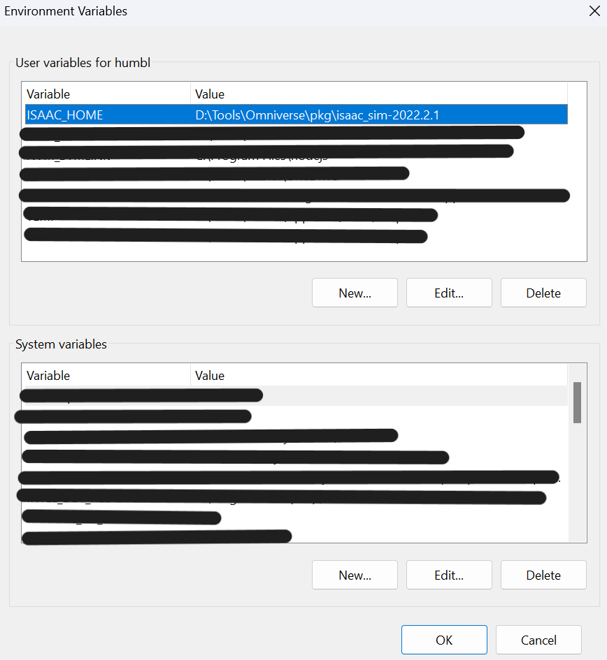

# Affordance Learning Sandbox

- [Report](#report)
- [🧪 Setup](#-setup)
  - [💻 Device Specifications](#-device-specifications)
  - [🦾 Nvidia Omniverse](#-nvidia-omniverse)
    - [App Dependencies](#app-dependencies)
    - [⚛️ Nucleus](#️-nucleus)
  - [🌿 Conda](#-conda)
    - [🐍 Python](#-python)
    - [📦 Dependencies](#-dependencies)
    - [🔼 Additional Dependencies](#-additional-dependencies)
      - [🥇 OmniIsaacGymEnvs](#-omniisaacgymenvs)
      - [🥇 skrl](#-skrl)
  - [📂 VS Code](#-vs-code)
- [⏯️ Starting the Simulation](#️-starting-the-simulation)
- [📝 FAQ](#-faq)

# 🔬 Report
The report for this project can be found in this following repository:
https://github.com/Pipe-Runner-Lab/affordance-learning-sandbox-report

# 🧪 Setup

The following steps are required to run the project.

## 💻 Device Specifications

- CPU: 12th Gen Intel i9-12900H (20) @ 4.900GHz
- GPU: NVIDIA Geforce RTX 3070 Ti Laptop GPU
- RAM: 32GB
- OS: Windows 11 Pro / Ubuntu 22.04.3 LTS x86_64

## 🦾 Nvidia Omniverse

The project uses Nvidia Omniverse to render the simulation. The Omniverse application can be downloaded from the [Nvidia Omniverse website](https://www.nvidia.com/en-us/design-visualization/omniverse/). Make sure to install version number **2023.1.0**.

Once installation is done, add the `ISAAC_HOME` path to the environment variable list. This points to the root of Isaac sim installation. For example, my installation is at `D:\Tools\Omniverse\pkg\isaac_sim-2023.1.0`. This is how I have added it to my environment variables on Windows:

<center>

</center>

> The above image is outdated since this image was taken with an older version. Please don't use this as reference for the version number.

On Linux, simply add the following to your `.bashrc` or `.zshrc` file. I have assume default installation path set by Omniverse.

```bash
export ISAAC_HOME=$HOME/.local/share/ov/pkg/isaac_sim-2023.1.0
```

**Note:** This is important for the environment setup script uses this variable to complete the rest of the setup.

**Note:** On Ubuntu, if you can't run the AppImage, the following two settings might help:

1. `chmod +x <path-to-appimage>`
2. `sudo apt install libfuse2`

**Note:** When running Isaac Sim, sometimes it will take some time to compile the shaders. This is normal and will only happen the first time you run the application or if the cache has been cleared. This only happens on Linux. You can run `gsettings set org.gnome.mutter check-alive-timeout 60000` to avoid getting the popup.

### App Dependencies

TODO
`omni.isaac.sim.python.gym.headless.kit` and `omni.isaac.sim.python.gym.kit`.

```bash
...
...
"omni.isaac.sensor" = {}
```

### ⚛️ Nucleus

The USD files for Franka robots and a few other models are used from the Nvidia Omniverse Nucleus server. The Nucleus server can be started by running the following command. A one time local server credentials creation will be needed when Nucleus is setup for the first time.
Verify that the Nucleus server is running by navigating to http://localhost:3080 in a web browser.  
**Note:** If there are any issues with connection, try going to http://localhost:3080/ and restarting all services.  
**Note:** There is a bug on Linux which prevents setting any other username than `admin` and any other password than `admin`.

## 🌿 Conda

The project uses conda to manage the python environment. The conda package manager can be installed by following the instructions on the [conda website](https://docs.conda.io/projects/conda/en/latest/user-guide/install/).

### 🐍 Python

We start off by creating and activating a new environment for the project. We will use python version 3.10.

```bash
conda deactivate # Deactivate any existing environment
conda remove --name isaac-sim --all # Remove the environment if it already exists
conda env create -f environment.yml
conda activate isaac-sim
```

We also need to set environment variables that will be used for running the code.

On windows, run the following command:

```cmd
.\scripts\setup_conda_env.bat
```

On Linux, run the following command:

```bash
source ./scripts/setup_conda_env.sh
```

> This step needs to be done **every time** the environment is activated. Without this, the python scripts won't be able to find any of the Omniverse libraries.

### 📦 Dependencies

The project dependencies can be installed by running the following command from the root of the project.

**Note:** Ensure that pytorch is able to detect the GPU else the training scripts won't work. I had to switch to a different version of cuda for pytorch to detect the GPU. This is how I did it on my environment:

```bash
conda install pytorch==2.0.1 torchvision==0.15.2 torchaudio==2.0.2 pytorch-cuda=11.7 -c pytorch -c nvidia
```

**Note:** Since Omniverse has supplementary libraries that are meant to work with pytorch 2.0.1, we have to make sure the version we are installing in exactly the same as the one that Omniverse uses. Otherwise we will run into compatibility issues.

### 🔼 Additional Dependencies

Other than the dependencies listed in `environment.yml`, the following dependencies are required to run the project. Make sure to install them in the same environment that we created above.

#### 🥇 OmniIsaacGymEnvs

The project uses the OmniIsaacGymEnvs package to create the RL tasks. The package can be installed by following the instructions on the [OmniIsaacGymEnvs GitHub page](https://github.com/NVIDIA-Omniverse/OmniIsaacGymEnvs).

#### 🥇 skrl

We use skrl to train the RL agents. The package can be installed by following the instructions on the [skrl documentation page](https://skrl.readthedocs.io/en/latest/intro/installation.html#python-package-index-pypi).

## 📂 VS Code

`.vscode/settings.json` contains the settings for VS Code. The settings file is used to setup the python interpreter and additional packages provided by isaac sim for intellisense. There are a few caveats right now on Windows for the environment variables to be picked up by VS Code. I have hardcoded the value to the value of `ISAAC_HOME` for now.

# ⏯️ Starting the Simulation

The project has to be run from the root of the project.

```bash
python -m src.mirage task=""
tensorboard --logdir runs
```

# 📝 FAQ

- Q. Cannot import `omni.isaac.core`?
  - A. https://forums.developer.nvidia.com/t/cannot-import-omni-isaac-core/242977/2
- Q. How to setup VS Code for Omniverse?
  - A. https://docs.omniverse.nvidia.com/isaacsim/latest/manual_standalone_python.html#isaac-sim-python-vscode
- Q. Why do I have to install torch by myself?
  - A. https://stackoverflow.com/questions/69180740/cant-install-gpu-enabled-pytorch-in-conda-environment-from-environment-yml
- Q. Can't run extension workflow from OIGE?
  - https://github.com/NVIDIA-Omniverse/OmniIsaacGymEnvs/issues/86#issuecomment-1773917767
- Q. [carb.physx.python] TypeError: can't convert np.ndarray of type numpy.uint16.
  - A. https://forums.developer.nvidia.com/t/lidar-cannot-detect-the-collision-enabled-model-and-cannot-use-semantic-data-on-oige/257765/4?u=piperunner.in
